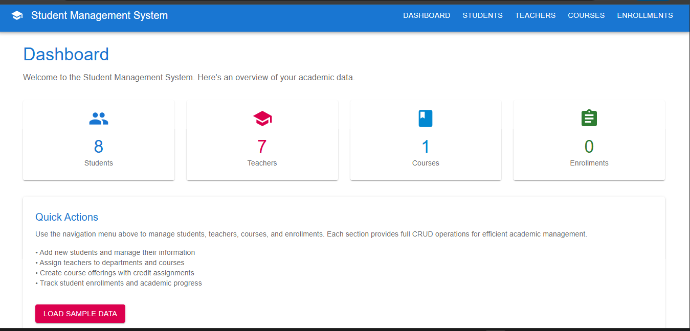
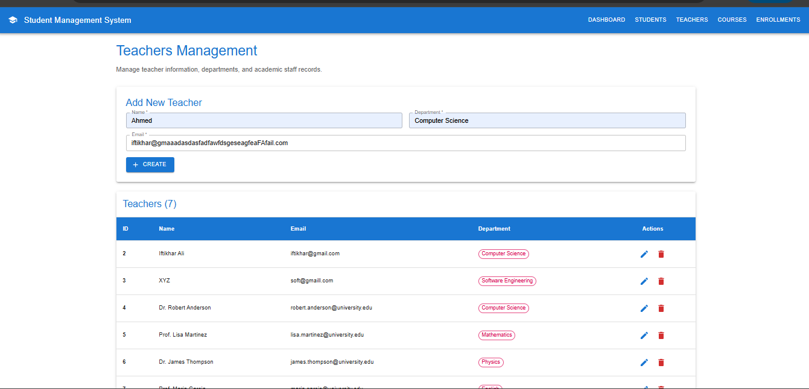
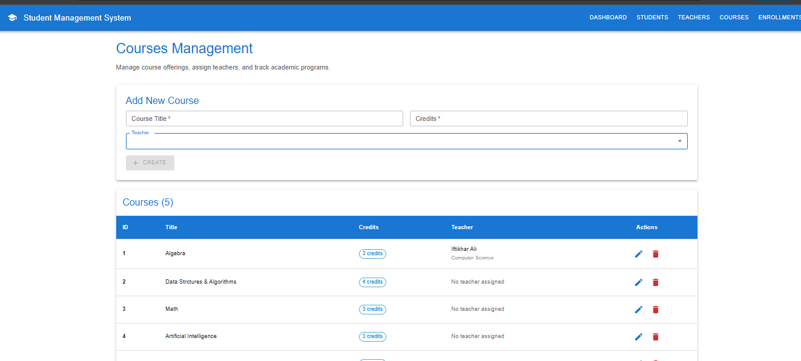
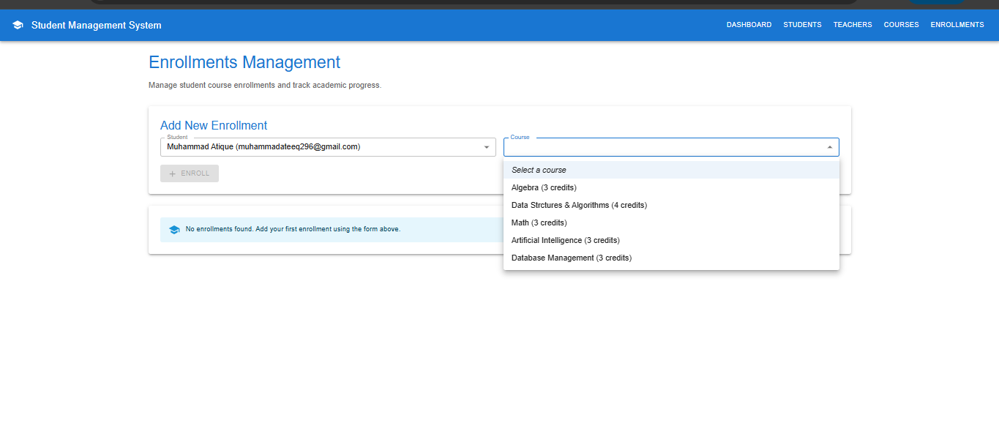

# Student Management System

Hey there! 👋 This is a **Student Management System** I built to manage academic data like students, teachers, courses, and enrollments. It's a full-stack web application with a modern React frontend and a .NET Core backend.

## What It Does

Think of it as a digital school management system where you can:
- 📚 **Manage Students**: Add, edit, and track student information
- 👨‍🏫 **Handle Teachers**: Manage faculty with their departments
- 📖 **Organize Courses**: Create courses and assign teachers
- 📝 **Track Enrollments**: See which students are taking which courses

## Screenshots

### Dashboard Overview

*The main dashboard showing statistics and quick actions*

### Students Management

*Add, edit, and manage student records*

### Teachers Management

*Manage faculty members and their departments*

### Courses Management

*Create courses and assign teachers*

### Enrollments

*Track student course enrollments*

## Tech Stack

### Backend
- **.NET Core 9.0** - The main framework
- **Entity Framework Core** - Database operations
- **SQL Server** - Data storage
- **ASP.NET Core Web API** - RESTful APIs

### Frontend
- **React 19** - User interface
- **Material-UI** - Beautiful, modern components
- **React Router** - Navigation between pages

## Getting Started

### Prerequisites
- .NET 9.0 SDK
- SQL Server (or SQL Express)
- Node.js (for the React app)

### Backend Setup
1. Open the project in Visual Studio or VS Code
2. Update the connection string in `appsettings.json`
3. Run the migrations: `dotnet ef database update`
4. Start the backend: `dotnet run`

### Frontend Setup
1. Navigate to the frontend folder: `cd student-management-frontend`
2. Install dependencies: `npm install`
3. Start the React app: `npm start`

The app will be available at:
- Backend API: `http://localhost:5273`
- Frontend: `http://localhost:3000`

## Features

✅ **Modern UI** - Clean, responsive design with Material-UI  
✅ **Full CRUD Operations** - Create, read, update, delete for all entities  
✅ **Form Validation** - Real-time validation with helpful error messages  
✅ **Sample Data** - One-click data seeding for testing  
✅ **Professional Routing** - Separate pages for each section  
✅ **Dashboard** - Overview with statistics and quick actions  

## Project Structure

```
StudentManagementSystem/
├── Controllers/          # API endpoints
├── Models/              # Database models
├── Data/                # Entity Framework context
├── Migrations/          # Database migrations
├── student-management-frontend/  # React app
│   ├── src/
│   │   ├── components/  # Reusable UI components
│   │   ├── pages/       # Page components
│   │   └── services/    # API calls
└── pics/                # Screenshots
```

## What I Learned

Building this project helped me understand:
- **Full-stack development** with .NET and React
- **Entity Framework Core** for database operations
- **Modern React patterns** with hooks and functional components
- **Material-UI** for professional UI design
- **API design** and RESTful principles
- **Project architecture** and code organization


**Built with ❤️ using .NET Core and React**

Feel free to explore the code and let me know if you have any questions!
